# 数据结构课程设计

#### 1751650 蒋伟博

## 考试报名系统项目

### 0. 项目简介  
考试报名工作给各高校报名工作带来了新的挑战，给教务管理部门增加了很大的工作量。
本项目是对考试报名管理的简单模拟，用控制台选项的选择方式完成下列功能：
输入考 生信息；输出考生信息；查询考生信息；添加考生信息；修改考生信息；删除考生信息。 

### 1. 概述  
- #### 项目要求及建议  
  本项目的实质是完成对考生信息的建立，查找，插入，修改，删除等功能。
  其中考生信息包括准考证号，姓名，性别，年龄和报考类别等信息。
  项目在设计时应首先确定系统的数据结构，定义类的成员变量和成员函数；
  然后实现各成员函数以完成对数据操作的相应功能； 
  最后完成主函数以验证各个成员函数的功能并得到运行结果。（建议采用链表实现）

- #### 实现方法  
  本项目采用了链表建立数据库（由`database`类实现），每一个节点（由`student`类实现）记录考生报名信息。  
  注：链表中没有专门的头结点和尾结点。
  
### 2. 类及类成员介绍  
 - #### student类  
   - ###### 成员变量  
   |成员名称 |属性|类型|描述|
   |--------|---|---|----|
   |next|private|student*|指向下一个考生的指针|
   |studentID|private|string|记录考生考号|
   |name|private|string|记录考生姓名|
   |gender|private|string|记录考生性别|
   |age|private|int|记录考生年龄|
   |choice|private|string|记录考生报考类别|
 
 - #### Database类
   - ###### 成员变量
   |成员名称 |属性|类型|描述|
   |--------|----|---|----|
   |first|private|student*|指向Student对象组成的链表的头指针|
   |studentNUM|private|int|记录数据库中考生数量|
   
   - ###### 成员函数
   |函数名称|属性|返回值类型|描述|
   |-------|---|---|---------|
   |database|public|void|构造函数|
   |~database|public|void|析构函数，清空数据库中数据，释放内存|
   |isEmpty|private|bool|判断数据库是否为空|
   |SmpDisplay|private|void|显示一个考生的个人信息，作为查询输出的内部函数|
   |HeadDisplay|private|void|打印显示考生个人信息需要的表头,为内部函数|
   |search|private|void|以学生ID为索引搜索考生节点的地址，内部使用|
   |BulidDatabase|public|void|输入初始考生信息，建立数据库|
   |InsertStu|public|void|插入新的考生数据模块|
   |FindStu|public|void|查找考生模块|
   |DeleteStu|public|void|删除考生节点|
   |ReviseInfo|public|void|修改考生信息模块|
   |StatDatabase|public|void|打印数据库中考生的统计信息|
   
### 3. 核心代码解释
- #### 建立数据库
 #####建立数据库的过程，本质是建立链表的过程。
 #####本函数创新性的采用了`newSTU`和`lastSTU`两个指针来存储，在不占用很多空间的情况下避免了双层取值的操作，降低了阅读成本。
 ```c++
	student *newSTU, *lastSTU = NULL;
	for (int i = studentNUM; i; i--)
	{
		newSTU = new student;
		cin >> newSTU->studentID >> newSTU->name >> newSTU->gender
			>> newSTU->age >> newSTU->choice;
		if (i == studentNUM)
			first = newSTU;
		else
			lastSTU->next = newSTU;
		lastSTU = newSTU;
	}
	lastSTU->next = NULL;
 ```
 - #### 插入操作
  #####插入链表，需要先创建一个空`student`类文件，并填充数据。之后将其插入链表的指定位置。
  #####插入链表时，分为三类情况  
  1. 插入到链表的头部（即index == 1）  
  2. 插入到链表当中  
  3. 插入到链表尾部  
  #####我们发现，插入链表当中和插入链表尾部的函数可以合并。我们在代码中体现了这一特性。这也是我们的创新点之一。
  ```c++
	if (index <= 0 || index > studentNUM + 1)
	{
		cout << "对不起：输入非法，无法插入到相应位置。" << endl;
		return;
	}
	cin >> one->studentID >> one->name >> one->gender
		>> one->age >> one->choice;
	studentNUM++;
	if (index == 1)
	{
		one->next = first;
		first = one;
	}
	else
	{
		student *temp = first;
		for (int i = index - 2; i; i--)
			temp = temp->next;
		one->next = temp->next;
		temp->next = one;
	}
```
 - #### 查找操作
 #####我们对数据库的查找也进行了优化。将搜索功能分为`search`的内部函数和`FindStu`的外部函数。
 #####`search`函数负责根据学生的`id`查找所在的位置。除了返回学生的当前指针`ans`外，还返回了它的上一个指针`previous`，提供给删除和查询函数使用。
 #####如果没有查找到,`ans`和`previous`都返回`NULL`。如果查找到的学生在链表的第一个，则`ans`正常返回地址，`previous`返回`NULL`。
 ```c++
 void database::search(string& id, student *&ans, student *&previous)
 {
 	ans = first, previous = NULL;
 	while (ans != NULL)
 	{
 		if (ans->studentID == id)
 			return;
 		previous = ans;
 		ans = ans->next;
 	}
 	ans = previous = NULL;
 }
```
 - #### 删除操作
 #####和插入操作类似。要判断两个边界条件。一是现在的数据是否为空，如果为空则无法删除。二是要删除的成员是否在数据库中。如果没有也无法删除。
 #####和插入类似，删除也是分为是否在链表头结点两种情况讨论，而不是三种情况。
 ```c++
void database::DeleteStu()
{
	if (isEmpty())
	{
		cout << "对不起：目前没有考生可以删除。" << endl;
		return;
	}

	string id;
	cout << "请输入你要删除的考生的考号：";
	cin >> id;

	student *StudentToDel, *previousStudent;
	search(id, StudentToDel, previousStudent);
	if (StudentToDel == NULL)
	{
		cout << "对不起：没有找到相关考生。" << endl;
		return;
	}

	studentNUM--;
	if (previousStudent == NULL)
		first = StudentToDel->next;
	else
		previousStudent->next = StudentToDel->next;
	delete StudentToDel;
}
```

 - #### 修改操作
 #####先通过传入的考生考号查找到考生所在的节点；若确实找到了考生，则对相应的部分进行修改。
 ```c++
 void database::ReviseInfo()
 {
 	if (isEmpty())
 	{
 		cout << "对不起：目前没有考生可供修改。" << endl;
 		return;
 	}
 
 	string id;
 	cout << "请输入你要修改的考生的考号：";
 	cin >> id;
 
 	student *StudentToFind, *temp;
 	search(id, StudentToFind, temp);
 	if (StudentToFind == NULL)
 	{
 		cout << "对不起：没有找到相关考生。" << endl;
 		return;
 	}
 
 	int itemToRevise;
 	cout << "请输入你要修改项目（1为考号，2为姓名，3为性别，4为年龄，5为报考类别）"<<endl;
 	cout << "请输入你要修改项目：";
 	cin >> itemToRevise;
 
 	switch (itemToRevise)
 	{
 	case 1:
 		cout << "请输入新的考号：";
 		cin >> StudentToFind->studentID;
 		break;
 	···
 	default:
 		cout << "对不起：输入的项目不存在。" << endl;
 	}
 }
 ```
 - #### 统计操作
 #####首先输出学生的人数。如果数据库为空，则提示没有考生。
 #####之后从头指针一直读取到链表尾部，在读取的同时输出学生信息。
 ```c++
 void database::StatDatabase()
 {
 	if (isEmpty())
 	{
 		cout << "目前数据库中暂无考生。" << endl;
 		return;
 	}
 	cout << "目前共有" << studentNUM << "名考生。" << endl;
 	HeadDisplay();
 
 	student *student = first;
 	while (student != NULL)
 	{
 		SmpDisplay(student);
 		student = student->next;
 	}
 }
 ```
 ### 4. 项目运行效果  
 
 - 建立数据库  
 
   说明：程序一旦开始运行，便会要求建立数据库，并要求输入数据库的初始大小。  
   键入数据库大小后，程序便会根据数据库的大小要求输入考生信息。该要求会一直打印，直到输入了足够的数据。  
   输入的数据要求每项之间用任意个空格隔开。
 
 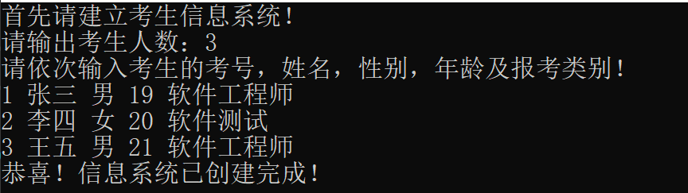
 
 - 插入考生信息  
 
   说明：键入1，便会进入插入信息分支，程序会要求输入插入的考生的信息。  
   输入的数据要求每项之间用任意个空格隔开。
 
 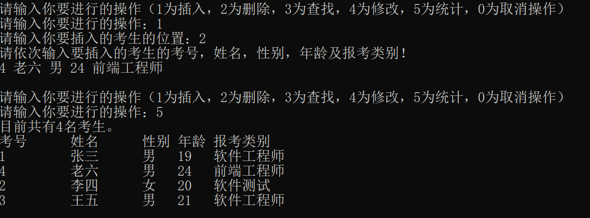
 
 - 删除考生信息
 
   说明：键入2，便会进入删除信息分支，程序会要求输入删除的考生的考号。
 
 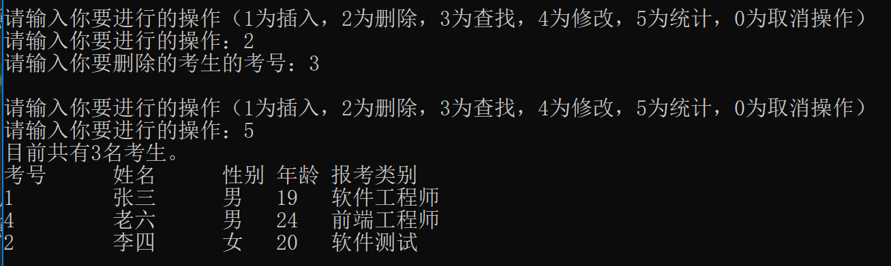
 
 - 查找考生信息 
 
   说明：键入3，便会进入查找信息分支，程序会要求输入查找的考生的考号，并返回找到的信息。
 
 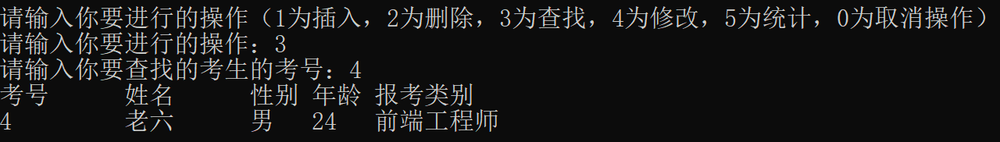
 
 - 修改考生信息
 
   说明：键入4，便会进入修改信息分支，程序会要求输入查找的考生的考号。
   之后会进入选择分支，可以对要该考生的
   
 
 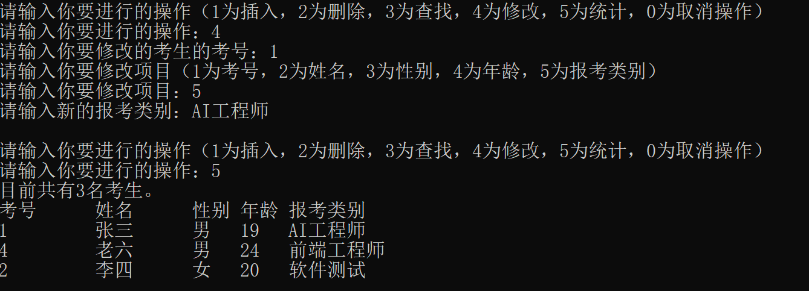
 
 - 统计考生信息
 
   说明：键入5，便会进入统计信息分支，程序会打印考生人数，并打印整个数据库。
 
 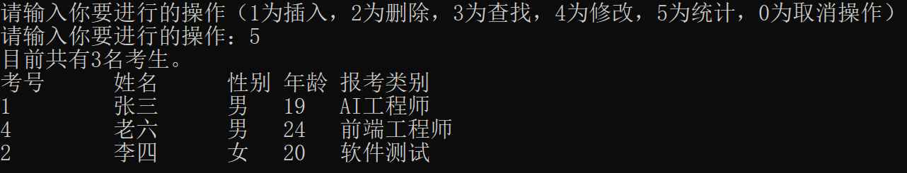
 
### 5. 容错测试

- #### 建立数据库时输入错误的考生人数大小  

  输入小于0的考生人数，一律视为0
  
  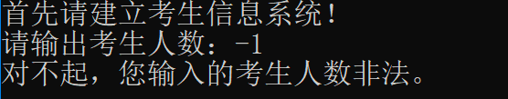
  
- #### 插入时输入错误的位置  

  输入小于1的位置，一律视为1  
  输入大于链表长度的位置，一律插在链表末尾
  
  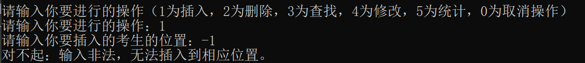
  
- #### 试图删除不存在的考生  

  打印提示信息：“查无此人！”
  
  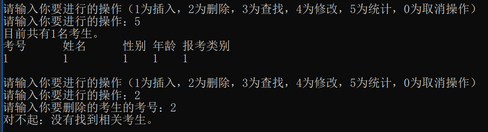
  
- #### 试图查找不存在的考生  

  打印提示信息：“查无此人！”
  
  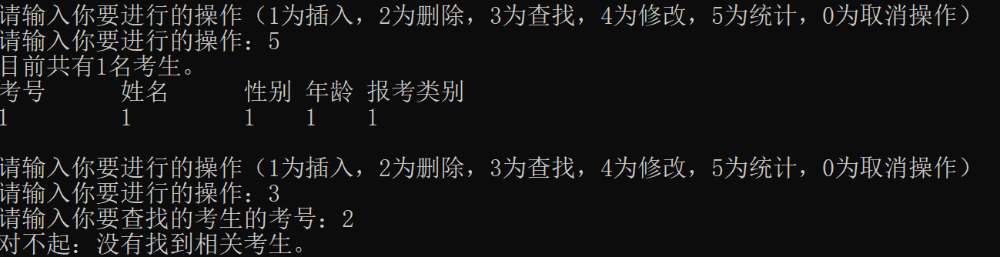
  
- #### 试图修改不存在的考生  

  打印提示信息：“查无此人！”
  
  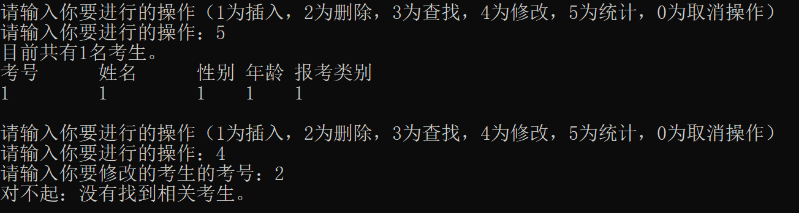