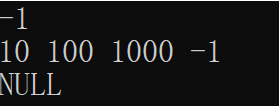
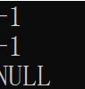

# 数据结构课程设计

#### 1751650 蒋伟博

## 两个有序链表序列的交集

### 0. 项目简介 

#####已知两个非降序链表序列 `S1` 和 `S2`，设计函数构造出 `S1` 和 `S2`的交集新链表 `S3`。 
#####输入说明：输入分 2 行，分别在每行给出由若干个正整数构成的非降序序列， 用-1 表示序列的结尾（-1 不属于这个序列）。数字用空格间隔。
#####输出说明：在一行中输出两个输入序列的交集序列，数字间用空格分开，结尾不能有多余空格；若新链表为空，输出`NULL`。

### 1. 概述  
- #### 项目要求及建议  
  #####本题已知序列是非降序链表序列，要将其合并。算法轻松，但需要考虑以下边界条件。
   - 两个序列其中一个是空序列的情况。包括两个序列都是空序列。
   - 合并完其中一个序列还有末尾未合并的情况。这时末尾肯定不在交集里。因此舍弃。
- #### 实现方法
  #####本题已经规定使用链表，并且新的链表不能覆盖旧的链表。
  #####我们的工作就是新建一个链表类对象，将待排序对象的数据复制到新对象中，并保证新对象中的数据是非降序的。
  #####本题中，我们使用了带头节点的链表。这样写的好处是方便知道链表的长度，同时可以效验新链表的长度是否正确。

### 2. 类及类成员介绍

- #### linknode类
  
  - ##### 成员变量
  |成员名称 |属性|类型|描述|
  |--------|----|---|----|
  |next|public|linknode*|指向下一个链表节点的指针|
  |value|public|int|存储该节点的数据|
  
- #### link类
  
  - ##### 成员变量
  |成员名称 |属性|类型|描述|
  |--------|----|---|----|
  |head|private|linknode*|指向链表头节点的指针|

  - ##### 成员函数
  |函数名称|返回值类型|描述|
  |-------|---------|--------|
  |link|void|构造函数|
  |operator>>|istream&|从IO窗口读入一个非降序链表|
  |operator<<|ostream&|向IO窗口输出排序好的链表|
  |getIntersection|link&|核心合并代码，返回一个排序好的link类对象|
  
### 3. 核心代码解释
- #### 输入序列
  #####输入序列的过程，本质是建立链表的过程。
  #####这里需要用`istream&`来作为返回值。这样可以实现连续输入。
  #####注意到本题要求以-1输入作为链表的结尾。要对输入为-1的数据做单独判断。
```c++
istream& operator>>(istream& in, link& me)
{
	me.head = new linknode;
	me.head->value = 0;
	linknode *nodenow = me.head;
	int readin;
	while (1)
	{
		in >> readin;
		if (readin == -1)
			break;
		nodenow->next = new linknode;
		nodenow = nodenow->next;
		nodenow->value = readin;
		me.head->value++;
	}
	nodenow->next = 0;
	return in;
}
```
- #### 输出序列
 #####从头指针一直读取到链表尾部，在读取的同时输出信息。要注意链表不能为空，否则不输出。
 #####与输入类似，这里需要用`ostream&`来作为返回值。这样可以实现连续输出。
```c++
ostream& operator<<(ostream& out, link& me)
{
	if (me.head->value == 0)
		out << "NULL" << endl;
	else
	{
		linknode *nodenow = me.head;
		do
		{
			nodenow = nodenow->next;
			out << nodenow->value << ' ';
		}
		while (nodenow->next != 0);
		out << endl;
	}
	return out;
}
```
- #### 合并核心代码
 #####我们新建了三个核心变量`aNodeNow`、`abNodeNow`、`ansNodeNow`。
 #####`aNodeNow`和`abNodeNow`变量，负责存放a链表和b链表当前的搜索位置。`ansNodeNow`变量负责存放新建序列的当前填充入口。
 #####使用while循环。`while (aNodeNow != 0 && bNodeNow != 0)`在a链表和b链表都没有走到末尾时合并。跳出循环后，a链表或b链表可能没有到末尾。但我们已经得到了全部的结果。
 
```c++
link& link::getIntersection(const link &a, const link &b)
{
	linknode *ansNodeNow = this->head = new linknode;
	this->head->value = 0;
	linknode *aNodeNow = a.head->next, *bNodeNow = b.head->next;
	while (aNodeNow != 0 && bNodeNow != 0)
	{
		if (aNodeNow->value == bNodeNow->value)
		{
			ansNodeNow->next = new linknode;
			ansNodeNow = ansNodeNow->next;
			ansNodeNow->value = aNodeNow->value;
			this->head->value++;
			aNodeNow = aNodeNow->next;
			bNodeNow = bNodeNow->next;
		}
		else if (aNodeNow->value < bNodeNow->value)
			aNodeNow = aNodeNow->next;
		else
			bNodeNow = bNodeNow->next;
	}
	ansNodeNow->next = 0;
	return *this;
}
```
### 4. 项目运行效果  

 说明：前两行输入两个非降序序列，以-1结尾。最后一行输出两个序列的交集。
 
 测试用例：L1: 1->2->5 L2: 2->4->5->8->10
 
 预期结果：2 5
 
 实验结果
 
 
 
### 5. 边界测试
- #### 交集为空的情况
  测试用例：L1: 1->3->5 L2: 2->4->6->8->10
 
  预期结果：NULL
 
  实验结果
 
  

- #### 完全相交的情况
  测试用例：L1: 1->2->3->4->5 L2: 1->2->3->4->5
 
  预期结果：1 2 3 4 5
 
  实验结果
 
  
  
- #### 其中一个序列完全属于交集的情况
  测试用例：L1: 3->5->7 L2: 2->3->4->5->6->7->8

  预期结果：3 5 7
  
  实验结果
 
  
  
- #### 其中一个序列为空的情况
  测试用例：L1: NULL L2: 10->100->100
 
  预期结果：NULL
 
  实验结果
 
  
  
- #### 两个序列都为空的情况
  测试用例：L1: NULL L2: NULL
 
  预期结果：NULL
 
  实验结果
 
  
  
