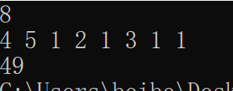
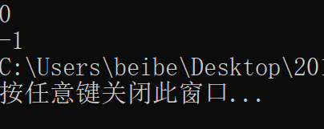

# 数据结构课程设计

#### 1751650 蒋伟博

## 修理牧场

### 0. 项目简介 
农夫要修理牧场的一段栅栏，他测量了栅栏，发现需要N块木头，每块木头长度为整数Li个长度单位，于是他购买了一个很长的，能锯成N块的木头，即该木头的长度是Li的总和。但是农夫自己没有锯子，请人锯木的酬金跟这段木头的长度成正比。为简单起见，不妨就设酬金等于所锯木头的长度。例如，要将长度为20的木头锯成长度为8，7和5的三段，第一次锯木头将木头锯成12和8，花费20；第二次锯木头将长度为12的木头锯成7和5花费12，总花费32元。如果第一次将木头锯成15和5，则第二次将木头锯成7和8，那么总的花费是35（大于32）.

### 1. 概述

- 项目要求  
  1. 输入格式：输入第一行给出正整数N（N<10^4），表示要将木头锯成N块。第二行给出N个正整数，表示每块木头的长度。  
  2. 输出格式：输出一个整数，即将木头锯成N块的最小花费。

- 实现方法  

  此题要求构造一棵哈夫曼树。沿着哈夫曼树，自根向下按广度优先遍历的树叶即是每段木头的截取时机；每个叶子的值为木头的长度，每一个非叶子节点的值都等于左右儿子值之和，于是根节点的值就是最小开销。  

  但是我们注意到，这题的结果只是要求求出总花费，并没有要求算出具体的策略。所以尽管使用哈夫曼树或者堆的方法能够提供更多的信息，方便后续维护。但就此题来说，直接逆向求解无疑是最高效的方法。
  
  维护一个按花费排列的非降序链表, 每次将该链表中最小的两者相加后消去两者, 之后再将和加入链表。最后直到链表中仅剩一个元素为止。在这个过程中, 记录每次”合并”(锯一次木头的逆操作)的花费。
  
  我们采用带头节点的链表，链表头的`cost`值用来存放链表的长度。

### 2. 类及类成员介绍

- #### node类
  
  - ##### 成员变量
  |成员名称 |属性|类型|描述|
  |--------|----|---|----|
  |next|private|node*|指向下一个链表节点的指针|
  |length|private|int|存储当前木条的长度|
  |cost|private|int|切割这根木条需要的花费，初始值为0|
  
- #### huffmanTree类
  
  - ##### 成员变量
  |成员名称 |属性|类型|描述|
  |--------|----|---|----|
  |huffmanTree|private|node*|指向链表头节点的指针|

  - ##### 成员函数
  |函数名称|返回值类型|描述|
  |-------|---------|--------|
  |huffmanTree|void|构造函数|
  |delfirst|node*|删除值最小的节点，并返回该节点|
  |addnode|void|将节点插入链表。可以是初始节点，也可以是部分合并的节点|
  |getHuffmanTree|void&|计算合并模块|
  |getAns|int|返回最终结果|
  
### 3. 核心代码解释
  - #### 节点插入
    #####将节点插入链表。同时将节点长度计数加一。
    #####关键代码是`if(now->cost+now->length<mynode->cost+mynode->length)`一句。要注意不止要比较木块的花费，也不止要比较木块的长度，而是两者都要。
    #####因为这个算法的核心，就是要让只有一个节点时的cost最小，根据递归，每一层都要求下一层最小。而合并后的花费是两个木块的花费与长度之和。因此要让当前节点的花费与长度之和最小。
```c++
void huffmanTree::addnode(node* mynode)
{
	node *now=headNode->next,*pre=headNode;
	while(now!=NULL)
	{
		if(now->cost+now->length<mynode->cost+mynode->length)
		{
			pre=now;
			now=now->next;
		}
		else break;
	}
	pre->next=mynode;
	mynode->next=now;
	headNode->cost++;
}
```
  - #### 删除最小节点
    #####删除第一个(花费最小)的节点，并返回该节点。需要注意的是，如果当前链表为空，则返回`NULL`。否则正常返回。
```c++
node* huffmanTree::delfirst()
{
	if(headNode->cost<=0)
		return 0;
	node *ans=headNode->next;
	headNode->next=ans->next;
	headNode->cost--;
	return ans;
}
```
 - #### 计算合并模块
   #####这是程序的核心模块。逻辑是从链表中取出两个最小的节点。这就是构建哈夫曼树的逻辑。我们使用链表来体现。
   #####合并两段木块之后的新木块的长度是两个木块长度相加，而注意，新木块的花费不仅是两个木块花费之和，还要加上两个木块的长度。
   #####之后将新节点添加到链表中。最后别忘了释放内存。
```c++
void huffmanTree::getHuffmanTree()
{
	node *first,*second;
	while(headNode->cost>1)
	{
		first=delfirst();
		second=delfirst();
		int totLength=first->length+second->length;
		int totCost=first->cost+second->cost+totLength;
		node *newNode=new node(totLength,totCost);
		addnode(newNode);
		delete first,second;
	}
}
```
### 4. 项目运行效果  
  说明：在程序运行之初，用户会被要求输入木头数量N，用以接受接下来每段木头的长度。 之后逐个输入木头长度Li。最后输出将木头锯成N块的最小花费。
  
  - 运行截屏  
  
    
    
### 5. 容错测试

  - 当输入错误的数值时  
    
  注：当输入错误的N小于等于0时，程序不会计算合并，而直接返回-1。
