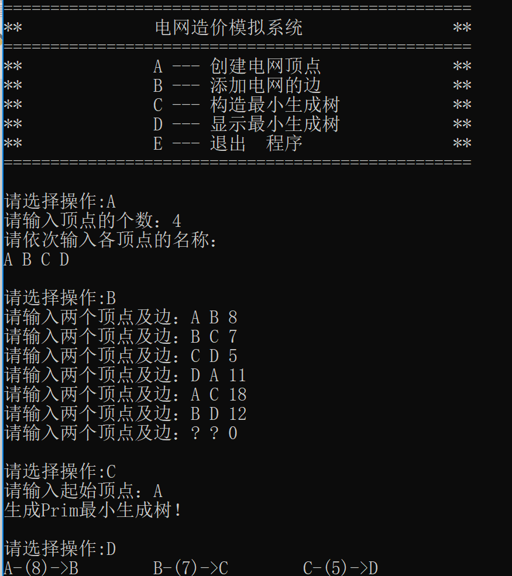
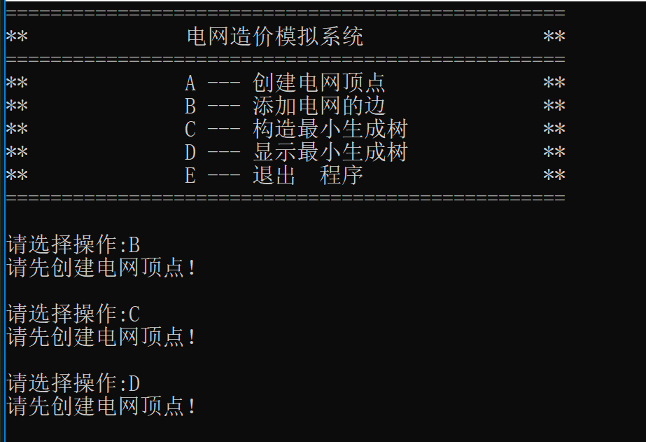
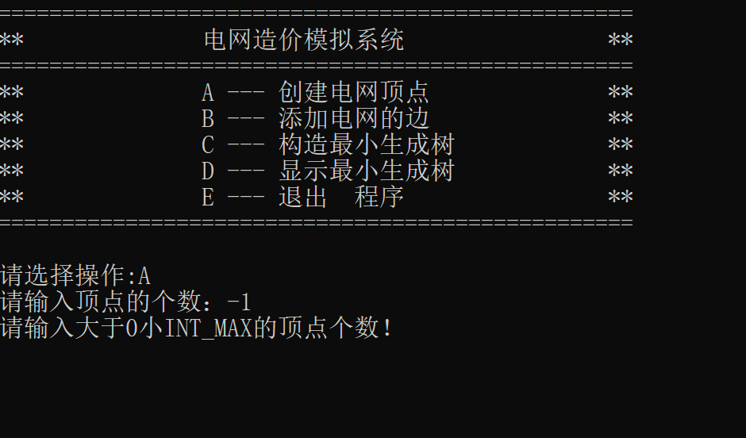
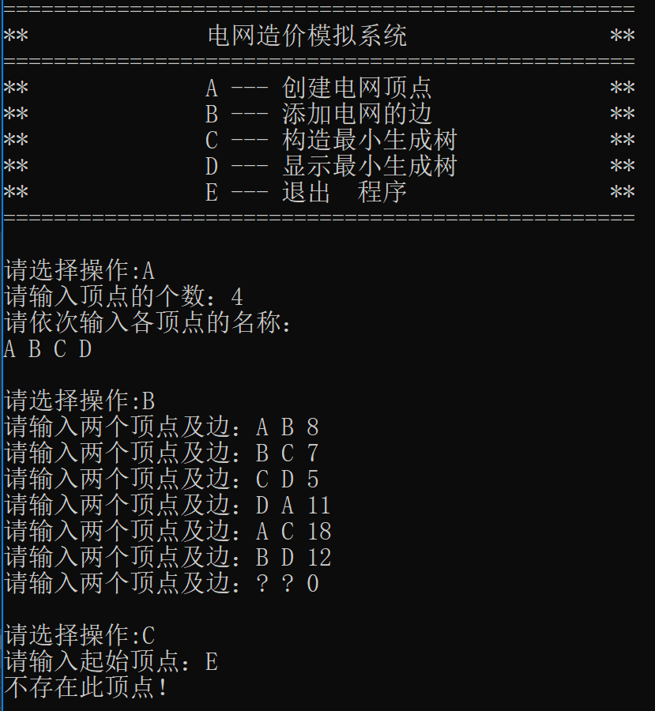

# 数据结构课程设计

#### 1751650 蒋伟博

## 电网建设造价模拟系统
   
### 0. 项目简介
假设一个城市有n个小区，要实现n个小区之间的电网都能够相互接通，构造这个城市n个小区之间的电网，使总工程造价最低。请设计一个能够满足要求的造价方案。

### 1. 概述

- 项目要求  
在每个小区之间都可以设置一条电网线路，都要付出相应的经济代价。n个小区之间最多可以有n（n-1）/2条线路，选择其中的n-1条使总的耗费最少。  

- 实现方法  
这是图论中最典型的构建最小生成树的问题，解决方法由Prim算法和Kruskal算法。由于此题要求能够制定起始顶点，故采用Prim算法。

### 2. 类及类成员介绍

- #### Node类

  - ##### 成员变量  
  |成员名称|属性|类型|描述|
  |-------|----|----|---|
  |insideName|public|int|记录顶点的内部编号|
  |cost|public|int|记录从某一顶点到自身的开销|
  |next|public|Node*|邻接表中指向下个顶点的指针|

- #### Feature类

  - ##### 成员变量  
  |成员名称|属性|类型|描述|
  |-------|----|----|---|
  |known|public|bool|记录顶点是否已被加入生成树中|
  |weight|public|int|记录从上个顶点到达自身的开销|
  |lastAdaj|public|int|记录树中与其连接的上个节点的编号|

  - ##### 成员函数  
  |函数名称|返回值类型|描述|
  |-------|----------|---|
  |Feature|无|构造函数|
  |update|bool|修改变量值|

- #### Graph类  

  - ##### 成员变量  
  |成员名称|属性|类型|描述|
  |-------|----|----|---|
  |numOfNode|private|int|记录图中顶点的数量|
  |nameList|private|string*|记录节点的名称|
  |adjaList|private|Node**|储存图的邻接表|
  |featureList|private|Feature*|储存节点的特征值|

  说明：特征值指Feature类中节点的权值、内部编号以及上个节点编号等信息

  - ##### 成员函数
  |函数名称|返回值类型|描述|
  |-------|----------|---|
  |Graph|无|构造函数|
  |~Graph|无|析构函数|
  |storeName|bool|储存顶点的名字|
  |findName|int|将顶点的名字转换为内部编号|
  |storeAdja|bool|邻接给定的两个顶点，并储存在邻接表中|
  |canDoPrim|bool|初始化最小生成树，并检查有无孤立点|
  |getMinFromFeatureList|int|查找featureList中权值最小且不在生成树上的点|
  |buildPrimTree|bool|建立最小生成树|
  |printPrimTree|void|打印最小生成树|
  
- #### program类  
   |函数名称|返回值类型|描述|
   |-------|----------|---|
   |enterNode|void|输入各节点名字并加以存储|
   |enterEdge|void|前端获得合法插入边的数据，传递给Graph|
   |buildTree|void|建立最小生成树的入口函数|
   |init|void|程序起点，做一些功能分支的判断|
  说明：这个类用来初始化程序，控制整个程序的运行。是本程序封装类中的最高层次。

### 3. 核心代码解释  

  - 储存边的权值  
  这里需要注意无向图的邻接表储存方法。  
  ```c++
  cout << "请输入两个顶点及边：";
  cin >> name1 >> name2 >> cost;
  ...
  /*因为是无向图，所以两个点都要互相储存对方*/
  graph->storeAdja(num1, num2, cost);
  graph->storeAdja(num2, num1, cost);
  ```
  因为无向图没有方向，所以使用邻接表储存顶点之间的关系时，我们规定，当b储存为a的邻接点时，那么这只意味着由a可以到达b，反之则不成立。基于这一点，我们要将用户输入的两个顶点分别储存一次，将另一个顶点储存在各自的邻接表中。  
  为了代码便于理解和复用，没有在storeAdja函数中直接实现这个功能，而是选择调用两次这个函数，分别执行将b储存到a的邻接表和将a储存到b的邻接表的功能。  
  最后值得一提的是，邻接表的实现极为简单，它只是一个单向链表而已，链表的表头储存在指针数组adjaList中，通过下标识别是哪一个顶点的邻接表。这也是为什么我们选择使用内部编号而不是顶点原本的名字的原因之一。  

  - 检查是否可生成最小生成树  
  ```c++
bool Graph::canDoPrim(int index)
{
	for (int i = 0; i < numOfNode; i++)//初始化特征表中的每项数值
	{
		if (adjaList[i] == NULL)//检查图中是否有孤立点
		{
			cout << "有孤立点，无法生成最小生成树！" << endl;
			return false;
		}
		featureList[i] = Feature(INT_MAX, -1);
	}
	featureList[index].weight = 0;//确定起始点
	return true;
}
  ```
  在构建最小生成树时，伴随着每个顶点的各种特征的不断更新，所以要在正式构建之前将储存特征的数组进行初始化。同时还要检查图中是否存在孤立点——当存在孤立点时，是无法生成最小生成树的。检查的方法很简单，只要确保每个顶点的邻接表都不为空就行。  
  另外，在应用Prim算法构建最小生成树时，要先指定最小生成树的起始顶点（根），由这个根出发，执行构建的任务。所以在这里，我们将输入的起始顶点权值设为0，也就是将它设为起始点。

  - 构建最小生成树  
  这是本项目最重要的部分，前面所有的数据处理都是为了构建最小生成树服务的。  
  ```c++
bool Graph::buildPrimTree()
{
	bool allPointChecked = false;
	int numOfChecked = 0;
	while (!allPointChecked)
	{
		int index = getMinFromFeatureList();//找到当前未达到最优状态的权值最小的点
		if (index == -1)
		{
			cerr << "请先添加电网的边！" << endl;
			return false;
		}

		Node* temp = adjaList[index];//从邻接表中提取index的邻接点
		while (temp != NULL)
		{
			int name = temp->insideName;
			if(!featureList[name].known)
				featureList[name].update(temp->cost, index);//更新权值
			temp = temp->next;
		}
		featureList[index].known = true;//index已被检测完毕，达到最优
		numOfChecked++;//被检测过的点的数目加1

		if (numOfChecked == numOfNode)//所有点都被检测完毕
			allPointChecked = true;
	}
	return true;
}
  ```
  这个函数做了四件事情：
  1. 获取当前所有未达到最优状态（即以最小的权值连接在生成树上）的顶点中，权值最小的一个  
  2. 遍历这个顶点的所有邻接点，更新未达到最优状态的点  
  3. 将这个顶点标记为已达到最优状态，并将达到最优状态的点的数量加1  
  4. 检查是否所有点都已达到最优状态  

  这也就是Prim算法的大致过程。当然，在细节的实现上略有不同。如Prim算法中，对于选取接下来要处理的点的要求是：所有邻接于生成树的顶点中，权值最小的那一个点。但是通过巧妙地设计算法，这里将这个要求转变为“寻找当前未达到最优状态的节点中，权值最小的那一个”。这是因为我们在初始化时，将每一个未处理的顶点的权值设置为INT_MAX，而经过处理的点——也就是邻接于生成树的点——的权值必然小于这个数字。所以我们只要保证是从未达到最优状态的点中选取权值最小的顶点，即可满足Prim算法的要求。

- 输入顶点数目和名称  
在程序开始运行后，用户应当首先选择A项，输入顶点数量和名称。如果用户试图跳过这一步，那么他们会收到一条错误提示。  
```c++
cout << "请输入顶点的个数：";
int num;
cin >> num;
while (cin.fail() || num < 1)
{
	cerr << "请输入大于0小INT_MAX的顶点个数！" << endl;
	cin.clear();
	cin.ignore();//防止缓冲区溢出
	cin >> num;
}

if (graph != NULL)
	delete graph;
graph = new Graph(num);
...
enterNode(num, graph);
```
### 4. 项目运行效果
- 添加电网的边  
没有添加边的顶点，一概被视为孤立点。在由孤立点的前提下是无法建立最小生成树的。所以用户应当保证自己输入了足够的边，使得整个图是连通的。  

- 构造最小生成树  
在构造最小生成树时，要求：  
  1. 图必须是连通的  
  2. 指定的顶点必须存在于图中  

-  运行截图  
  
  
### 5. 容错测试

  - 未输入顶点的情况下运行其它选项  
  

  - 输入不恰当的的顶点个数  
  

  - 指定错误的起始顶点  
  